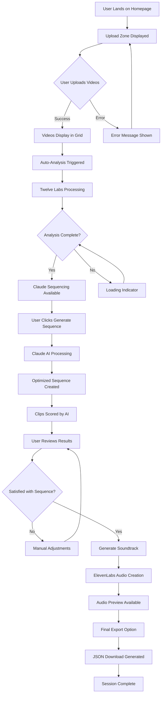

# User Interaction Flow & System Diagrams

## 🎭 User Journey Overview

The Video Sequencer Demo provides an intuitive workflow for AI-powered video content creation. Users can upload multiple video clips, analyze them with AI, generate optimized sequences, and export professional results.

## 🔄 Complete User Interaction Flow



## 📱 User Interface Components Flow

### 1. Initial State - Upload Zone
```
┌─────────────────────────────────────────────┐
│              Video Sequencer Demo           │
├─────────────────────────────────────────────┤
│  ┌─────────────────────────────────────────┐  │
│  │     🎬 Drag & Drop Video Files         │  │
│  │                                         │  │
│  │     📁 or Click to Browse Files        │  │
│  │                                         │  │
│  │     Max 20 files, 100MB each           │  │
│  └─────────────────────────────────────────┘  │
└─────────────────────────────────────────────┘
```

### 2. Video Upload Progress
```
┌─────────────────────────────────────────────┐
│              Upload Progress                │
├─────────────────────────────────────────────┤
│  📹 video1.mp4 ████████████ 100%           │
│  📹 video2.mp4 ████████▒▒▒▒ 75%            │
│  📹 video3.mp4 ████▒▒▒▒▒▒▒▒ 40%            │
│                                             │
│  [Cancel Upload] [Continue]                 │
└─────────────────────────────────────────────┘
```

### 3. Video Grid View
```
┌─────────────────────────────────────────────┐
│              Video Library (5 videos)       │
├─────────────────────────────────────────────┤
│  ┌─────┐ ┌─────┐ ┌─────┐ ┌─────┐ ┌─────┐    │
│  │ 🎬  │ │ 🎬  │ │ 🎬  │ │ 🎬  │ │ 🎬  │    │
│  │ V1  │ │ V2  │ │ V3  │ │ V4  │ │ V5  │    │
│  │30s  │ │45s  │ │22s  │ │38s  │ │29s  │    │
│  └─────┘ └─────┘ └─────┘ └─────┘ └─────┘    │
│                                             │
│  [🔍 Analyze All] [➕ Add More]              │
└─────────────────────────────────────────────┘
```

### 4. Analysis Phase
```
┌─────────────────────────────────────────────┐
│              AI Analysis in Progress         │
├─────────────────────────────────────────────┤
│  🤖 Twelve Labs: Analyzing content...      │
│  ████████████████████████████████ 100%     │
│                                             │
│  🧠 Claude AI: Generating sequence...      │
│  ████████████▒▒▒▒▒▒▒▒▒▒▒▒▒▒▒▒▒▒ 60%       │
│                                             │
│  ⏱️ Estimated time remaining: 2 minutes    │
└─────────────────────────────────────────────┘
```

### 5. Generated Sequence View
```
┌─────────────────────────────────────────────┐
│              Optimized Sequence             │
├─────────────────────────────────────────────┤
│  Sequence Order: [3] → [1] → [5] → [2] → [4] │
│                                             │
│  📊 Clip Scores (1-10):                    │
│  ┌─────┐ Visual: 8.5  Audio: 7.2          │
│  │ V3  │ Engagement: 9.1  Flow: 8.3       │
│  │22s  │ Overall Score: 8.3                │
│  └─────┘                                   │
│                                             │
│  [🎵 Generate Soundtrack] [⬇️ Export]       │
└─────────────────────────────────────────────┘
```

## 🎯 Detailed User Interaction Scenarios

### Scenario 1: First-Time User
1. **Landing**: User arrives at clean, intuitive interface
2. **Onboarding**: Clear instructions and visual cues guide upload
3. **Upload**: Drag-and-drop or click-to-browse functionality
4. **Feedback**: Real-time progress bars and status updates
5. **Discovery**: Automatic analysis begins, user sees AI at work
6. **Results**: Clear visualization of AI recommendations
7. **Export**: Simple one-click export of final results

### Scenario 2: Power User Workflow
1. **Bulk Upload**: Multiple file selection and batch processing
2. **Preview**: Quick video previews before analysis
3. **Customization**: Manual sequence adjustments if needed
4. **Iteration**: Re-generate sequences with different parameters
5. **Quality Control**: Review AI scores and reasoning
6. **Professional Export**: Detailed JSON with all metadata

### Scenario 3: Error Recovery
1. **Upload Failure**: Clear error messages with retry options
2. **API Limits**: Graceful degradation with alternative workflows
3. **Network Issues**: Offline indicators and retry mechanisms
4. **File Format Issues**: Format validation with helpful suggestions

## 🔄 System State Transitions

### Application State Machine
```
┌─────────────┐    upload    ┌─────────────┐
│   INITIAL   │─────────────▶│  UPLOADING  │
└─────────────┘              └─────────────┘
                                     │
                                 complete
                                     ▼
┌─────────────┐              ┌─────────────┐
│  EXPORTED   │              │   UPLOADED  │
└─────────────┘              └─────────────┘
      ▲                              │
   export                        analyze
      │                              ▼
┌─────────────┐              ┌─────────────┐
│  SEQUENCED  │              │  ANALYZING  │
└─────────────┘              └─────────────┘
      ▲                              │
   sequence                     complete
      │                              ▼
┌─────────────┐              ┌─────────────┐
│   SCORED    │◀─────score───│  ANALYZED   │
└─────────────┘              └─────────────┘
```

## 🎨 Visual Design Patterns

### Color Coding System
- **🟢 Green**: Successful operations, completed states
- **🔵 Blue**: Active processing, user actions available
- **🟡 Yellow**: Pending operations, waiting states
- **🔴 Red**: Errors, failed operations
- **⚪ Gray**: Disabled states, unavailable actions

### Loading States
```
🔄 Spinning Loader: File uploads
📊 Progress Bar: Long-running AI analysis
⏳ Pulse Animation: Short operations
🤖 AI Icon Animation: External API calls
```

### Responsive Breakpoints
- **Mobile (320px-768px)**: Single column, stacked layout
- **Tablet (768px-1024px)**: Two column grid
- **Desktop (1024px+)**: Full grid layout with sidebar

## 📊 User Feedback & Progress Indicators

### Progress Visualization
1. **Upload Progress**: Individual file progress bars
2. **Analysis Progress**: Overall completion percentage
3. **Processing Steps**: Step-by-step breakdown of AI workflow
4. **Real-time Updates**: Live status messages during processing

### Success Indicators
- ✅ File upload complete
- 🤖 AI analysis finished
- 🎵 Soundtrack generated
- 📥 Export ready for download

### Error Handling UX
- Clear, non-technical error messages
- Suggested actions for resolution
- Retry buttons for transient failures
- Contact information for persistent issues

## 🔗 Navigation & User Flow Optimization

### Primary User Paths
1. **Happy Path**: Upload → Analyze → Sequence → Export (4 clicks)
2. **Custom Path**: Upload → Analyze → Manual Edit → Export (5+ clicks)
3. **Retry Path**: Upload → Error → Retry → Success (variable)

### Accessibility Features
- Keyboard navigation support
- Screen reader compatibility
- High contrast mode available
- Focus indicators for all interactive elements

### Performance Considerations
- Lazy loading for video previews
- Progressive enhancement for features
- Offline capability indicators
- Bandwidth-aware video quality

This comprehensive user interaction documentation ensures a smooth, intuitive experience that maximizes the powerful AI capabilities while maintaining simplicity for users of all technical levels.